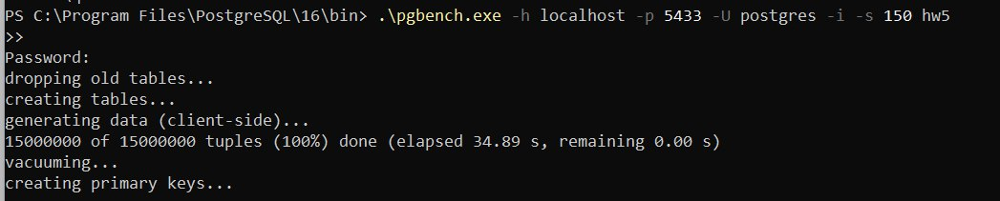

### Лабораторная работа №1 PGBENCH


## Введение
Целью данной лабораторной работы было провести тестирование производительности PostgreSQL с использованием инструмента pgbench.

## Создание Таблиц и генерация данных
```sql
create table Routes
(
	id serial primary key,
	route_name varchar not null,
	distance int not null check(distance > 0),
	days_on_way int check(days_on_way > 0),
    payment int generated always as (distance * 18) stored
    check (payment >= 0)
)
create table Drivers
(
	id serial primary key,
	last_name varchar not null,
	first_name varchar not null,
	patronymic varchar,
	driving_experience int check(driving_experience >= 0)
)
create table Work_done
(
	route_id int references Routes(id),
	driver_id int references Drivers(id),
	departure_date date,
    return_date date,
    bonus int check(bonus >= 0),
   	primary key (route_id, driver_id, departure_date)
);
```

Попросил Chat GPT сгенерировать данные для таблицы 

```sql
INSERT INTO Routes (route_name, distance, days_on_way)
VALUES 
  ('Петрозаводск-Казань', 900, 2),
  ('Благовещенск-Тула', 6000, 6),
  ('Волжский-Новокузнецк', 3200, 5),
  ('Тамбов-Бийск', 3500, 4),
  ('Стерлитамак-Сыктывкар', 1800, 3),
  ('Рязань-Уссурийск', 7000, 7),
  ('Калининград-Ульяновск', 1700, 3),
  ('Йошкар-Ола-Барнаул', 2600, 5),
  ('Тула-Нижний Тагил', 1500, 3),
  ('Таганрог-Тамбов', 800, 2),
  ('Череповец-Сургут', 2500, 4),
  ('Пенза-Севастополь', 3000, 4),
  ('Камышин-Петропавловск-Камчатский', 7000, 7),
  ('Новороссийск-Нижний Ломов', 2000, 3),
  ('Армавир-Курск', 1500, 3),
  ('Новосибирск-Салават', 2500, 4),
  ('Хабаровск-Воронеж', 8000, 8),
  ('Смоленск-Ульяновск', 1200, 2),
  ('Курган-Саратов', 2500, 4),
  ('Великий Новгород-Ижевск', 800, 2),
  ('Нижневартовск-Сызрань', 3000, 4),
  ('Ростов-на-Дону-Курск', 700, 2),
  ('Каменск-Уральский-Брянск', 1800, 3),
  ('Чита-Севастополь', 5500, 6),
  ('Кострома-Орск', 1300, 3),
  ('Владимир-Челябинск', 2000, 3),
  ('Тольятти-Калуга', 1500, 2),
  ('Курган-Омск', 800, 2),
  ('Кемерово-Сургут', 2500, 4),
  ('Улан-Удэ-Тверь', 4000, 5),
  ('Самара-Мурманск', 2800, 4),
  ('Йошкар-Ола-Ставрополь', 1200, 2),
  ('Тула-Курск', 300, 1),
  ('Ульяновск-Тамбов', 600, 2),
  ('Таганрог-Курган', 2800, 4),
  ('Тверь-Саратов', 1200, 2);*/

INSERT INTO Drivers (last_name, first_name, patronymic, driving_experience) VALUES ('Иванов', 'Петр', 'Сергеевич', 5);
INSERT INTO Drivers (last_name, first_name, patronymic, driving_experience) VALUES ('Смирнов', 'Алексей', 'Игоревич', 8);
INSERT INTO Drivers (last_name, first_name, patronymic, driving_experience) VALUES ('Кузнецов', 'Егор', 'Андреевич', 3);
INSERT INTO Drivers (last_name, first_name, patronymic, driving_experience) VALUES ('Попов', 'Дмитрий', 'Александрович', 6);
INSERT INTO Drivers (last_name, first_name, patronymic, driving_experience) VALUES ('Васильев', 'Анатолий', 'Владимирович', 2);
INSERT INTO Drivers (last_name, first_name, patronymic, driving_experience) VALUES ('Козлов', 'Григорий', 'Станиславович', 4);
INSERT INTO Drivers (last_name, first_name, patronymic, driving_experience) VALUES ('Петров', 'Владислав', 'Николаевич', 7);
INSERT INTO Drivers (last_name, first_name, patronymic, driving_experience) VALUES ('Соколов', 'Евгений', 'Артемович', 5);
INSERT INTO Drivers (last_name, first_name, patronymic, driving_experience) VALUES ('Михайлов', 'Никита', 'Иванович', 9);
INSERT INTO Drivers (last_name, first_name, patronymic, driving_experience) VALUES ('Новиков', 'Сергей', 'Павлович', 3);
INSERT INTO Drivers (last_name, first_name, patronymic, driving_experience) VALUES ('Федоров', 'Александр', 'Егорович', 6);
INSERT INTO Drivers (last_name, first_name, patronymic, driving_experience) VALUES ('Морозов', 'Игорь', 'Валентинович', 8);
INSERT INTO Drivers (last_name, first_name, patronymic, driving_experience) VALUES ('Волков', 'Станислав', 'Дмитриевич', 4);
INSERT INTO Drivers (last_name, first_name, patronymic, driving_experience) VALUES ('Алексеев', 'Денис', 'Федорович', 2);
INSERT INTO Drivers (last_name, first_name, patronymic, driving_experience) VALUES ('Лебедев', 'Максим', 'Александрович', 7);
INSERT INTO Drivers (last_name, first_name, patronymic, driving_experience) VALUES ('Семенов', 'Павел', 'Михайлович', 5);
INSERT INTO Drivers (last_name, first_name, patronymic, driving_experience) VALUES ('Егоров', 'Артем', 'Геннадьевич', 6);
INSERT INTO Drivers (last_name, first_name, patronymic, driving_experience) VALUES ('Павлов', 'Роман', 'Алексеевич', 3);
INSERT INTO Drivers (last_name, first_name, patronymic, driving_experience) VALUES ('Карпов', 'Ярослав', 'Петрович', 9);
INSERT INTO Drivers (last_name, first_name, patronymic, driving_experience) VALUES ('Афанасьев', 'Илья', 'Анатольевич', 4);
INSERT INTO Drivers (last_name, first_name, patronymic, driving_experience) VALUES ('Куликов', 'Георгий', 'Иванович', 7);
INSERT INTO Drivers (last_name, first_name, patronymic, driving_experience) VALUES ('Орлов', 'Виталий', 'Андреевич', 6);
INSERT INTO Drivers (last_name, first_name, patronymic, driving_experience) VALUES ('Щербаков', 'Валентин', 'Алексеевич', 5);
INSERT INTO Drivers (last_name, first_name, patronymic, driving_experience) VALUES ('Рябов', 'Владимир', 'Дмитриевич', 8);
INSERT INTO Drivers (last_name, first_name, patronymic, driving_experience) VALUES ('Маслов', 'Антон', 'Игоревич', 2);
INSERT INTO Drivers (last_name, first_name, patronymic, driving_experience) VALUES ('Игнатьев', 'Николай', 'Семенович', 4);
INSERT INTO Drivers (last_name, first_name, patronymic, driving_experience) VALUES ('Тихонов', 'Василий', 'Валерьевич', 6);
INSERT INTO Drivers (last_name, first_name, patronymic, driving_experience) VALUES ('Филатов', 'Даниил', 'Степанович', 3);
INSERT INTO Drivers (last_name, first_name, patronymic, driving_experience) VALUES ('Крюков', 'Герман', 'Яковлевич', 7);
INSERT INTO Drivers (last_name, first_name, patronymic, driving_experience) VALUES ('Богданов', 'Мирон', 'Борисович', 5);


INSERT INTO hw5."Sem2".work_done  (route_id, driver_id, departure_date, return_date, bonus)
VALUES
    (1, 1, '2023-01-20', '2023-01-22', 250),
    (1, 2, '2023-01-21', '2023-01-23', 270),
    (2, 3, '2023-01-25', '2023-01-27', 300),
    (2, 4, '2023-01-26', '2023-01-28', 330),
    (3, 5, '2023-01-30', '2023-02-01', 280),
    (3, 6, '2023-01-31', '2023-02-02', 310),
    (4, 7, '2023-02-05', '2023-02-07', 260),
    (4, 8, '2023-02-06', '2023-02-08', 290),
    (5, 9, '2023-02-10', '2023-02-12', 350),
    (5, 10, '2023-02-11', '2023-02-13', 370),
    (6, 11, '2023-02-15', '2023-02-17', 400),
    (6, 12, '2023-02-16', '2023-02-18', 430),
    (7, 13, '2023-02-20', '2023-02-22', 380),
    (7, 14, '2023-02-21', '2023-02-23', 410),
    (8, 15, '2023-02-25', '2023-02-27', 360),
    (8, 16, '2023-02-26', '2023-02-28', 390),
    (9, 17, '2023-03-05', '2023-03-07', 340),
    (9, 18, '2023-03-06', '2023-03-08', 370),
    (10, 19, '2023-03-10', '2023-03-12', 420),
    (10, 20, '2023-03-11', '2023-03-13', 450),
    (11, 21, '2023-03-15', '2023-03-17', 400),
    (11, 22, '2023-03-16', '2023-03-18', 430),
    (12, 23, '2023-03-20', '2023-03-22', 380),
    (12, 24, '2023-03-21', '2023-03-23', 410),
    (13, 25, '2023-03-25', '2023-03-27', 360),
    (13, 26, '2023-03-26', '2023-03-28', 390),
    (14, 27, '2023-03-30', '2023-04-01', 340),
    (14, 28, '2023-03-31', '2023-04-02', 370);
```

## Шаги выполнения

1. Запуск pgbench
Выполнили запуск pgbench для создания тестовой нагрузки на сервер.
```
pgbench -h 127.0.0.1 -p 5433 -U postgres -i -s 150 hw5
```

Опция -i используется для инициализации базы данных тестовыми данными. Опция -s 150 указывает на масштабный коэффициент 150, что создает 150 раз больше данных, чем размер по умолчанию.


###
2. Выполнение тестов
Использовали pgbench для запуска тестов с различными параметрами, такими как количество клиентов (-c), количество потоков (-j), продолжительность теста (-T) и другие.
<br/><br/>На 50 подключений

```
pgbench -h 127.0.0.1 -p 5433 -U postgres -c 50 -j 2 -P 60 -T 600 hw5
```


<br/><br/>На 80 подключений

```
pgbench -h 127.0.0.1 -p 5433 -U postgres -c 80 -j 2 -P 60 -T 600 hw5
```


<br/><br/>На 90 подключений
```
pgbench -h 127.0.0.1 -p 5433 -U postgres -c 90 -j 2 -P 60 -T 600 hw5
```


## Сравнение и Анализ результатов


Сравнение и анализ данных для различных количеств подключений
Введение
В данном разделе проведем сравнительный анализ результатов тестов pgbench при различных уровнях нагрузки, выраженных в количестве подключений. Рассмотрим тесты с 50, 80 и 90 подключениями и проанализируем полученные значения средних результатов.

Результаты тестов
50 подключений:

Средний результат: 4652 TPC

80 подключений:

Средний результат: 4508 TPC

90 подключений:

Средний результат: 4470 TPC

С увеличением количества подключений с 50 до 80 наблюдается небольшое снижение среднего результата, что может указывать на насыщение системы при более высокой нагрузке.

Увеличение количества подключений до 90 также сопровождается некоторым снижением производительности. Это может быть связано с достижением предела пропускной способности или ресурсов сервера.

Для полного анализа рекомендуется измерить время выполнения транзакций, чтобы определить, является ли ухудшение производительности связанным с увеличением времени выполнения операций.

#### Изменили параметр max_connections в конфигурации PostgreSQL и провели повторные тесты, проверяя, как изменение этого параметра влияет на производительность.

## Выводы
Работа с pgbench предоставила понимание производительности PostgreSQL при различных нагрузках. Оптимальная настройка параметров PostgreSQL, таких как количество соединений, критически важна для эффективной работы базы данных .